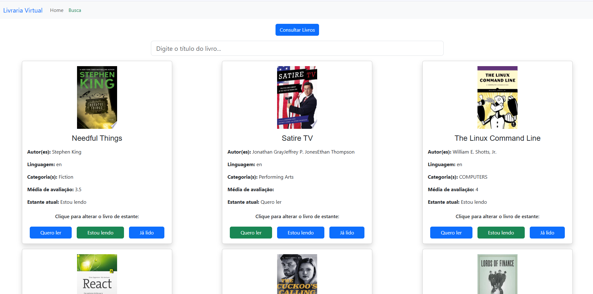

# Projeto Livraria Virtual

Este é um projeto de uma livraria virtual construída com **React**. O projeto permite que os usuários explorem livros, filtrem por estantes e alterem a estante de um livro (como "Quero ler", "Estou lendo" e "Já lido").
Todos os livros são buscados dessa API: https://api-books-dot-api-samples-423102.uc.r.appspot.com/api-docs

## Funcionalidades

- **Exibição de livros**: Mostra uma lista de livros com informações como título, autor, categoria, e avaliação média.
- **Filtros dinâmicos**: Exibe livros filtrados com base nas estantes (ex: "Quero ler", "Estou lendo", "Já lido").
- **Alteração de estante**: Permite que os usuários alterem a estante de um livro através de botões interativos.
- **Busca**: Inclui um campo de busca para filtrar livros por título.
- **Responsividade**: Design responsivo para garantir que a aplicação funcione bem em dispositivos móveis e desktops.

## Tecnologias Usadas

- **React**: Biblioteca principal para construção da interface do usuário.
- **Bootstrap**: Framework CSS para facilitar o design responsivo.

## Como Rodar o Projeto

Para rodar o projeto localmente, siga os seguintes passos:

### 1. Clone o Repositório

```bash
git clone https://github.com/vidalYep/Livraria-React-Boostrap.git
cd Livraria-React-Boostrap
```

### 2. Instale as Dependências
```bash
Copiar código
npm install
```

### 3. Inicie o Servidor de Desenvolvimento
```bash
Copiar código
npm start
```

Isso abrirá o projeto em http://localhost:3000 no seu navegador.

## Como Usar?

**Acesse a página de Busca:** Comece navegando até a página de busca, onde você pode explorar e pesquisar livros.

**Adicione os Livros às Estantes:** Ao encontrar os livros que deseja, basta adicionar cada um deles à estante correspondente com o clique de um botão. Você pode escolher entre as opções: "Quero ler", "Estou lendo", ou "Já lido".

**Volte à Home e Consulte suas Estantes:** Após adicionar os livros às suas estantes, retorne à página inicial (Home). Todos os livros que você adicionou serão automaticamente exibidos nas estantes apropriadas, permitindo que você acompanhe sua jornada de leitura!

### Estrutura do Projeto
**src/**: Contém os arquivos fonte do projeto.

**components/:** Componentes reutilizáveis como CardLivro, Estantes, Header, etc.

**pages/:** Páginas como Home, Buscar, etc.

**assets/:** Imagens e ícones utilizados na aplicação.

### Demonstração

#### Home

A página inicial exibe três estantes de livros. Aqui está uma imagem de como a tela se parece:


#### Buscar

Na página de busca, os usuários podem pesquisar livros e filtrar por estante. Aqui está a visualização da tela de busca:

